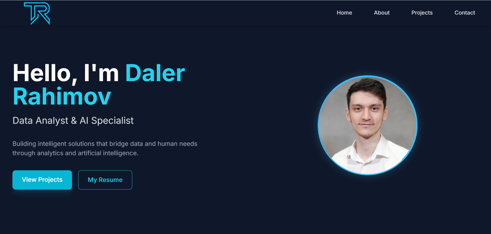

# 💼 Daler Rahimov – Personal Portfolio Website

This is the source code for my personal portfolio website. It highlights my professional background, technical skills, and selected projects in **AI, data analytics, and web development**.

## 🌐 Live Site
Visit: [https://dalerrahimov0.github.io/Portfolio/](https://dalerrahimov0.github.io/Portfolio/)

## 🧠 About Me
Hi! I'm Daler Rahimov, a Data Analyst & AI Specialist with a B.S. in Information Technology and a minor in Data Analytics. I have a strong passion for using intelligent systems to solve real-world problems.

I am currently pursuing my **MBA at the University of Nebraska at Kearney** and working as a **Graduate Assistant for the Office of Graduate Studies and Academic Innovation**.

---

## 🖥️ Features

- Clean and modern responsive design (HTML + Tailwind CSS)
- Project gallery with descriptions and links
- Resume download button (PDF)
- Contact form with email forwarding using [FormSubmit](https://formsubmit.io)
- GitHub integration (project links)
- Mobile-friendly layout

---

## 📬 Contact Form

This site uses [FormSubmit.io](https://formsubmit.io) for the contact form. Submissions are sent to my email and users are redirected to a custom thank-you page.

**Note:** You can configure your own email by updating the `action` attribute in the HTML `<form>` tag.

---

## 📸 Thumbnail

## 🔐 Disclaimer

This repo is primarily for demonstration. Please do **not reuse personal assets (images, email, etc.)** without permission.

---

## 🛠️ Technologies Used

- HTML5
- Tailwind CSS
- JavaScript
- FormSubmit (email form)
- GitHub Pages (or custom domain)

---

## 📫 Contact

- 📧 Email: rahimovd@lopers.unk.edu  
- 🌍 LinkedIn: [(https://www.linkedin.com/in/daler-rahimov/)]
- 🧠 GitHub: [https://github.com/dalerrahimov0)

---

## 📌 License

This project is open-source under the MIT License. Feel free to fork and customize it for your own use.

